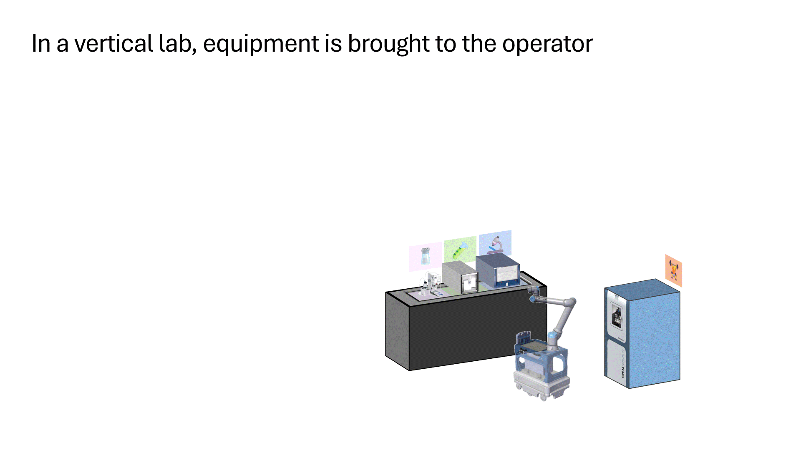

At the Vertical Cloud Lab @ Brigham Young University (Provo, UT USA), we integrate the concepts of vertical automation, cloud experimentation, and frugal twins to make autonomous experimentation more accessible (see below). We are a new lab and welcome early collaborators and contributors.

### Vertical Automation

Vertical labs optimize automation-friendly use of vertical space—so equipment comes to the operator (e.g., via a vertical lift module) rather than the operator moving between instruments.

*Fig: An "electrified" tray of a vertical lift module carries synthesis and characterization equipment to a storage position where experiments can run. When samples need to be transferred or maintenance needs to occur, the tray is brought back to the operator (e.g., robotic arm, human).*

<!---  --->

---

### Cloud Experimentation

Cloud labs enable remote, decentralized access to experimental resources—democratizing hardware, computation, and domain expertise.

*Fig: A [remotely accessible color matching demo](https://huggingface.co/spaces/AccelerationConsortium/OT-2-LCM). Users consume "credits" in a quota-based system to asynchronously and remotely request experiments, viewable via a YouTube livestream. The demo can also be accessed programatically (i.e., via Python) where both programmatic and manual control are shared seamlessly. As of Aug 2025, 1000+ experiments have been run asynchronously by dozens of users. It has been used for local and international outreach, demos, coursework, and workshops.*

---

### Frugal Twins
Frugal twins are low-cost, modular physical twins (like digital twins, but for hardware) that complement high-cost systems, enabling low-risk prototyping, lower barriers to lab automation, and multi-fidelity optimization (DOI: [10.1039/D3DD00223C](https://doi.org/10.1039/D3DD00223C)).

*Fig: [AMPERE-2](https://doi.org/10.1039/D5DD00180C) is a frugal twin for electrocatalyst discovery, enabling unit operations such as electrode cleaning, liquid handling, and electrodeposition via custom-built modules.*

<!---  --->

## Principal Investigator
- Sterling Baird ([`sgbaird`](https://github.com/sgbaird)) | Assistant Professor, Department of Mechanical Engineering, Brigham Young University (BYU) [[scholar](https://scholar.google.com/citations?user=UACmnBgAAAAJ)] [[linkedin](https://www.linkedin.com/in/sterling-baird/)]

## Core Research Thrusts
- Autonomous alloy discovery
- Autonomous electrochemistry
- Advanced Bayesian optimization

<!---

### Case study: Additively Manufactured Aerospace Alloys

An initial, remotely accessible self-driving lab workflow integrating the following hardware:
- Vertical lift module (automated storage and retrieval)
- Low-cost powder dosing
- Ultrasonic atomizer (human-in-the-loop)
- Small-scale metal 3D printer
- Mechanical testing hardware

Goal: closed-loop alloy discovery and a working example to de-risk transfer of vertical cloud labs to the community.

--->

## Software and Datasets

(coming soon)

Browse all org repositories:
- https://github.com/orgs/vertical-cloud-lab/repositories

## Join the Lab
We welcome:
- BYU undergraduates and graduate students
- External collaborators and visiting students
- Open-source contributors

How to get involved:
- Email (see [Sterling's profile](https://github.com/sgbaird))
- Include your interests, background, and links to relevant work (GitHub, CV)
- If applicable, reference specific org repos you'd like to contribute to

<!--
## Publications
- Use Google Scholar for an up-to-date list: https://scholar.google.com/citations?user=UACmnBgAAAAJ
-->

<!--
## Community and Conduct
- Contributing: [link to CONTRIBUTING.md if available]
- Code of Conduct: [link to CODE_OF_CONDUCT.md if available]
- License(s): [link or note if org uses a standard license across repos]

## Acknowledgements
- [List funding sources, facilities, or partner organizations]
- [Recognize contributors and collaborators]

-->
