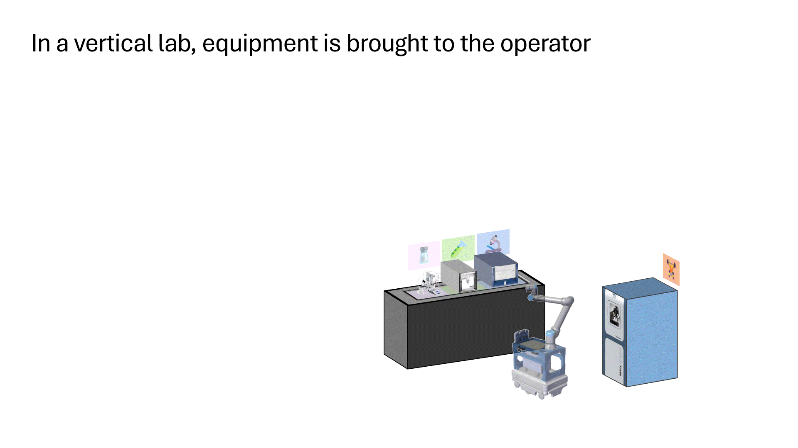
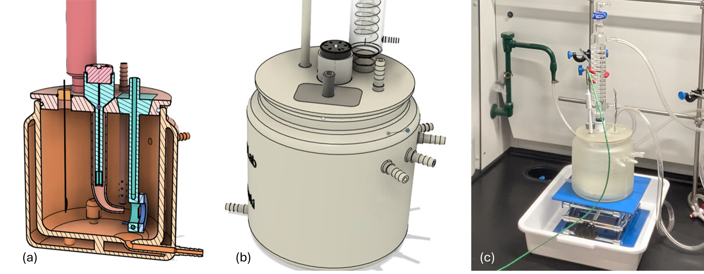

At the Vertical Cloud Lab @ Brigham Young University (Provo, UT USA), we integrate the concepts of vertical automation, cloud experimentation, and frugal twins into self-driving labs focused on discovering new structural, aerospace, and energy materials. We also conduct research on advanced optimization methods to find better materials with fewer iterations. We are a new lab and welcome early collaborators and contributors.

### Vertical Automation

Vertical labs maximize *automation-friendly* vertical space utilization—so equipment comes to the operator (e.g., via a vertical lift module) rather than the operator moving between instruments.

*Fig: An "electrified" tray of a vertical lift module carries synthesis and characterization equipment to a storage position where experiments can run. When samples need to be transferred or maintenance needs to occur, the tray is brought back to the operator (e.g., robotic arm, human).*

<!---  --->

---

### Cloud Experimentation

Cloud labs enable remote, decentralized access to experimental resources—democratizing hardware, computation, and domain expertise.

*Fig: A [remotely accessible color matching demo](https://huggingface.co/spaces/AccelerationConsortium/OT-2-LCM). Users consume "credits" in a quota-based system to asynchronously and remotely request experiments, viewable via a YouTube livestream. The demo can also be accessed programatically (i.e., via Python) where both programmatic and manual control are shared seamlessly. As of Aug 2025, 1000+ experiments have been run asynchronously by dozens of users. It has been used for local and international outreach, demos, coursework, and workshops.*

---

### Frugal Twins

Frugal twins are low-cost, modular physical twins (like digital twins, but for hardware) that complement high-cost systems, enabling low-risk prototyping, lower barriers to lab automation, and multi-fidelity optimization (DOI: [10.1039/D3DD00223C](https://doi.org/10.1039/D3DD00223C)).

*Fig: [AMPERE-2](https://doi.org/10.1039/D5DD00180C) is a frugal twin for electrocatalyst discovery, enabling unit operations such as electrode cleaning, liquid handling, and electrodeposition via custom-built modules.*

<!---  --->

## Core Research Thrusts

The core research of the group spans three topics: autonomous alloy discovery for additively manufactured aerospace alloys, autonomous electrochemical synthesis and characterization for energy applications, and advanced Bayesian optimization implementation, benchmarking, and algorithm development.

### Autonomous Alloy Discovery

The aerospace industry depends on metal alloys such as aluminum, titanium, steel, nickel, and copper alloys, and additive manufacturing can reduce lead time and costs while increasing design freedom for complex geometries. For example, NASA used selective laser melting to rapidly manufacture a shock-absorbing baffle component with minimal welding required, now used in the Space Launch System's RS-25 rocket engine. The Vertical Cloud Lab @ BYU aims to discover high-performing additively manufactured aerospace alloys. To help achieve this, we will begin by creating a remotely accessible self-driving lab workflow that integrates a vertical lift module, low-cost powder dosing units, an ultrasonic atomizer, a small-scale metal 3D printer, and mechanical testing equipment.

*Fig: Conceptual demonstration of an alloy discovery workflow via a metal alloy ultrasonic atomizer, laser powder-bed fusion 3D printing, and a tensile tester.*

<!-- NASA example of AM alloy used in real-world application: https://ntrs.nasa.gov/api/citations/20230016654/downloads/Metal_AM_Aerospace_Binghamton%20Univ_11-16-23.pdf -->

### Autonomous Electrochemistry

In many energy applications such as batteries, fuel cells, and catalysts, electrochemistry plays a critical role. These systems often involve many components with complex interfaces and interactions between each (electrodes, electrolytes, etc.). Many parameters can be changed, and it can be difficult to reliably reproduce results. Closing the loop to electrochemistry workflows can help improve the throughput and repeatability of experiments while reducing the number of experiments required to accomplish high-level research goals. Our lab will begin with autonomous systems for studying next-generation battery chemistries and electrolyzers for fuel cells, involving 3D printed electrochemical cells, automated sample exchange, and tuning material composition and characterization parameters.

*Fig: A resin-based 3D printed electrochemical cell used for accelerated stress testing of nickel electrodes for electrolysis (water splitting) experiments. (a) cross sectional CAD rendering of the cell, CAD rendering of the cell, the 3D printed and fully assembled electrochemical cell. More information is available in [the Electrode Lifecycle Enhancement through Computational Testing and Research Automation forum post](https://accelerated-discovery.org/t/electrode-lifecycle-enhancement-through-computational-testing-and-research-automation/510/1).*

<!--- Matthias G. fuel cell project --->

### Advanced Bayesian Optimization

Real-world chemistry and materials science optimization tasks are complex, and we want to tackle materials discovery challenges without making oversimplifying assumptions. We choose algorithms that are expressive enough to ingest the full complexity such as non-uniform noise, competing performance objectives, large search spaces, and use of information from related datasets. We do this by (1) reducing the barrier to implementation of existing state-of-the-art algorithms through scaffolding tools such as [Honegumi](https://honegumi.readthedocs.io/), (2) addressing the curse of benchmarking by creating reusable and cheap-to-evaluate Turing optimization benchmarks that are indistinguishable from real measurements, and (3) develop high-performing algorithms tailored to materials science that can ingest contextual information and domain knowledge through human-guidance, multi-task modeling, physics-based modeling, and large-scale models (i.e., foundation models, large language models).

*Fig: [Honegumi](https://honegumi.readthedocs.io/) ('ho-nay-goo-mee'), which means "skeletal framework" in Japanese, is a package for interactively creating minimal working examples for advanced Bayesian optimization topics. By toggling the options on the selection grid, a self-contained, error-free, and fully runnable code example is generated dynamically.*

<!--- --->

<!---

### Case study: Additively Manufactured Aerospace Alloys

An initial, remotely accessible self-driving lab workflow integrating the following hardware:
- Vertical lift module (automated storage and retrieval)
- Low-cost powder dosing
- Ultrasonic atomizer (human-in-the-loop)
- Small-scale metal 3D printer
- Mechanical testing hardware

Goal: closed-loop alloy discovery and a working example to de-risk transfer of vertical cloud labs to the community.

--->

## Software and Datasets

| Resource         | Link                                                                                 |
|------------------|--------------------------------------------------------------------------------------|
| Documentation    | [honegumi.readthedocs.io](https://honegumi.readthedocs.io/)                          |
| Repository       | [github.com/sgbaird/honegumi](https://github.com/sgbaird/honegumi)                   |
| Installation     | [`pip install honegumi`](https://pypi.org/project/honegumi/)                         |
| Paper            | [arxiv.org/abs/2502.06815](https://arxiv.org/abs/2502.06815)                         |

<!---
Browse all org repositories:
- https://github.com/orgs/vertical-cloud-lab/repositories --->

## Join the Lab
We welcome:
- BYU undergraduates and graduate students
- External collaborators and visiting students
- Open-source contributors

How to get involved:
- Email (see [Sterling's profile](https://github.com/sgbaird))
- Include your interests, background, and links to relevant work (GitHub, CV)
- If applicable, reference specific org repos you'd like to contribute to

## Principal Investigator

- Sterling Baird ([`sgbaird`](https://github.com/sgbaird)) | Assistant Professor, Department of Mechanical Engineering, Brigham Young University (BYU) [[scholar](https://scholar.google.com/citations?user=UACmnBgAAAAJ)] [[linkedin](https://www.linkedin.com/in/sterling-baird/)]

<!--
## Publications
- Use Google Scholar for an up-to-date list: https://scholar.google.com/citations?user=UACmnBgAAAAJ
-->

<!--
## Community and Conduct
- Contributing: [link to CONTRIBUTING.md if available]
- Code of Conduct: [link to CODE_OF_CONDUCT.md if available]
- License(s): [link or note if org uses a standard license across repos]

## Acknowledgements
- [List funding sources, facilities, or partner organizations]
- [Recognize contributors and collaborators]

-->
